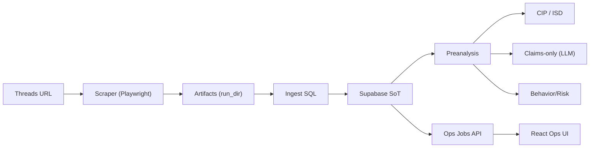

# Architecture

**Overview**
DiscourseLens 是一個針對 Threads 貼文的「抓取 → SoT 入庫 → 分析/敘事(僅 claims) → Ops 監控」系統。主要資料來源為 Threads HTML + comments tree，核心資料寫入 Supabase，分析結果以 `analysis_json` 為主。

**Core Components**
- Scraper: `scraper/fetcher.py`, `scraper/parser.py`, `scraper/scroll_utils.py`
- Ingest: `webapp/services/ingest_sql.py`
- Analysis (Deterministic): `analysis/preanalysis_runner.py`
- Analysis (LLM claims-only): `analysis/analyst.py`, `analysis/claims/*`
- Semantic Labeling: `analysis/cluster_interpretation.py`, `analysis/diagnostics/isd.py`
- Risk: `analysis/behavior_sidechannel.py`, `analysis/behavior_budget.py`, `analysis/risk_composer_min.py`
- Backend API: `webapp/app.py`, `webapp/routers/*`, `webapp/services/job_manager.py`
- Frontend: `dlcs-ui/src/*`
- Topic contract/spec: `docs/TOPIC_CONTRACT_V1.md`

**Data Flow (S1–S6)**
1. S1 Fetch + Ingest
說明：Playwright 抓取 Threads → artifacts，`ingest_sql.py` 將 `threads_posts` / `threads_comments` / `threads_comment_edges` 寫入 Supabase。

2. S2 Preanalysis (deterministic)
說明：`preanalysis_runner.py` 生成 `preanalysis_json`，包含 cluster assignments、reply matrix、physics、golden samples。

3. S3 CIP + ISD (Semantic)
說明：CIP 產生 cluster label/summary，ISD 對 label 穩定度與 evidence 做 gate，`database/integrity.py` 透過 run_id + allowlist 保護語意寫回。

4. S4 Claims-only (LLM)
說明：LLM 只生成 claims，經 audit 後寫入 `threads_claims` / `threads_claim_evidence` / `threads_claim_audits`。

5. S6 Behavior/Risk
說明：behavior side-channel + budget + risk brief，寫入 `threads_behavior_audits` / `threads_risk_briefs`。

**Storage Model (Supabase)**
- SoT tables: `threads_posts`, `threads_comments`, `threads_comment_edges`
- Analysis: `analysis_json`, `preanalysis_json`
- Semantic: `threads_cluster_interpretations`, `threads_cluster_diagnostics`, `threads_comment_clusters`
- Claims: `threads_claims`, `threads_claim_evidence`, `threads_claim_audits`
- Risk: `threads_behavior_audits`, `threads_risk_briefs`
- Ops: `job_batches`, `job_items`
- Topic (Phase-2 provisioned): `topic_runs`, `topic_posts`, `topic_meta_clusters`, `topic_lifecycle_daily`

**LLM Safety Gates**
- Claims: `analysis/claims/evidence_audit.py` 直接丟棄無證據 claims
- Semantic writeback: `database/integrity.py` run_id + allowlist

**Ops / Jobs**
- `JobManager` 透過 Supabase RPC 實作 claim/heartbeat/complete
- `/api/jobs/*` 為 Ops UI 的單一真實來源

**Known Gaps**
- Pipeline B/C 依賴 `pipelines/core.py`, `event_crawler.py`, `home_crawler.py`，但此 repo 內不存在
- 若需要啟用 B/C，必須補齊或移除這些依賴
- Topic API registry skeleton 已接入（`POST /api/topics/run`, `GET /api/topics/{topic_id}`）
- Topic worker / meta-cluster / lifecycle materialization 仍未接入（目前僅 registry 層）

**High-Level Diagram**

